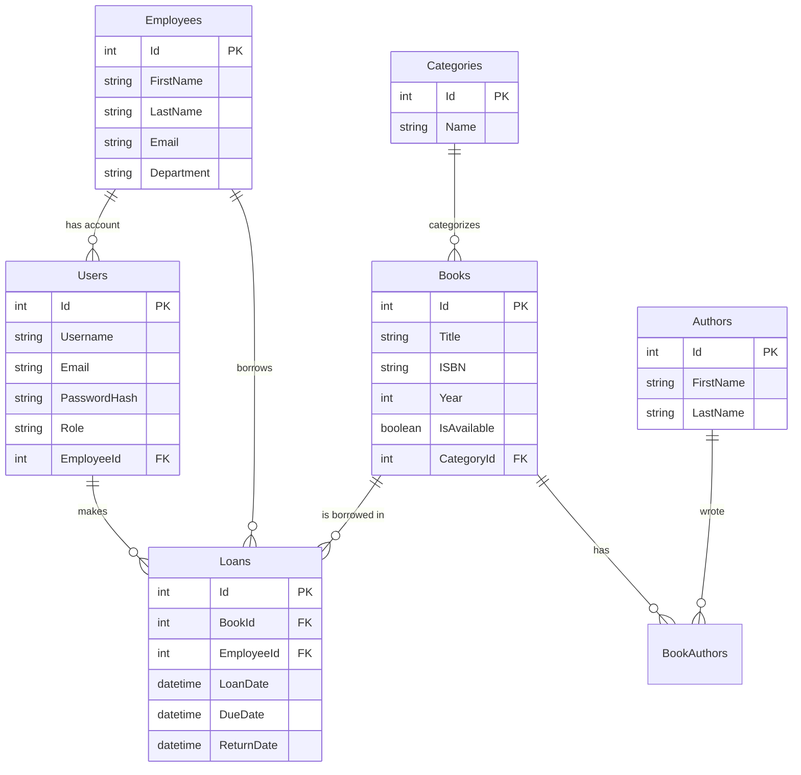
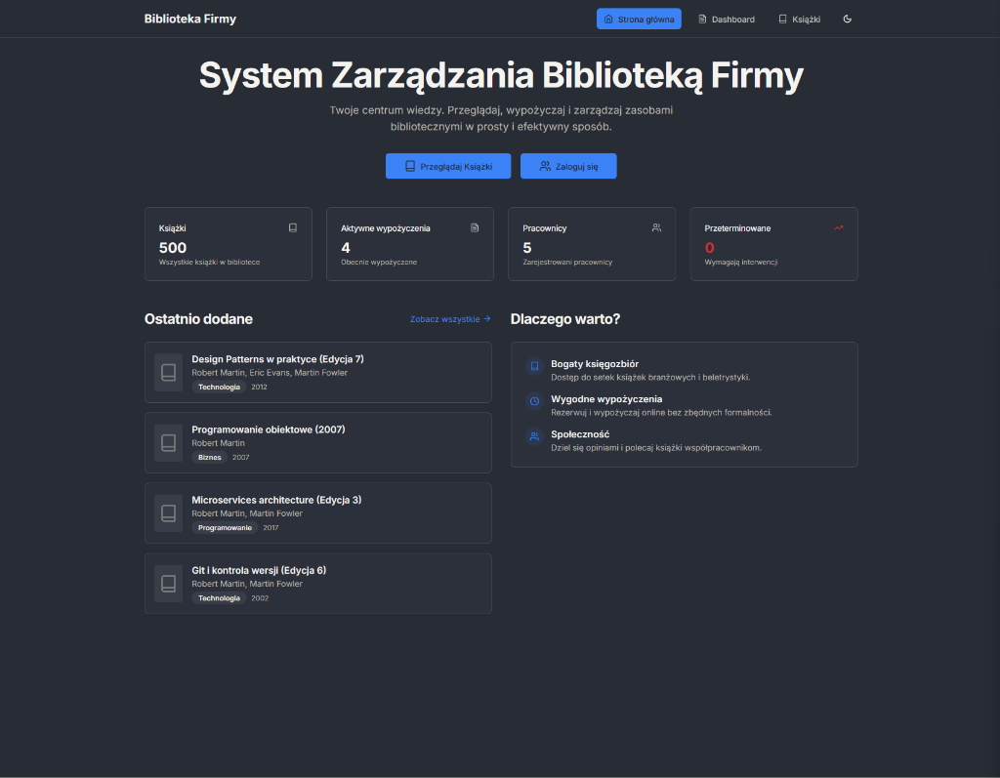
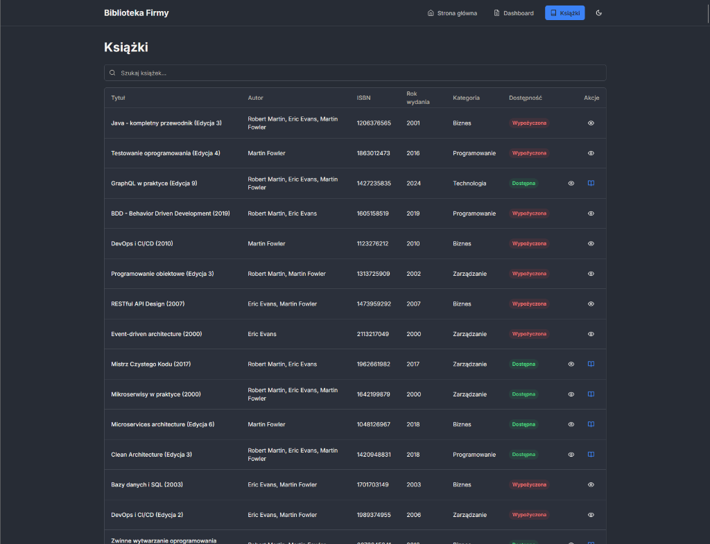
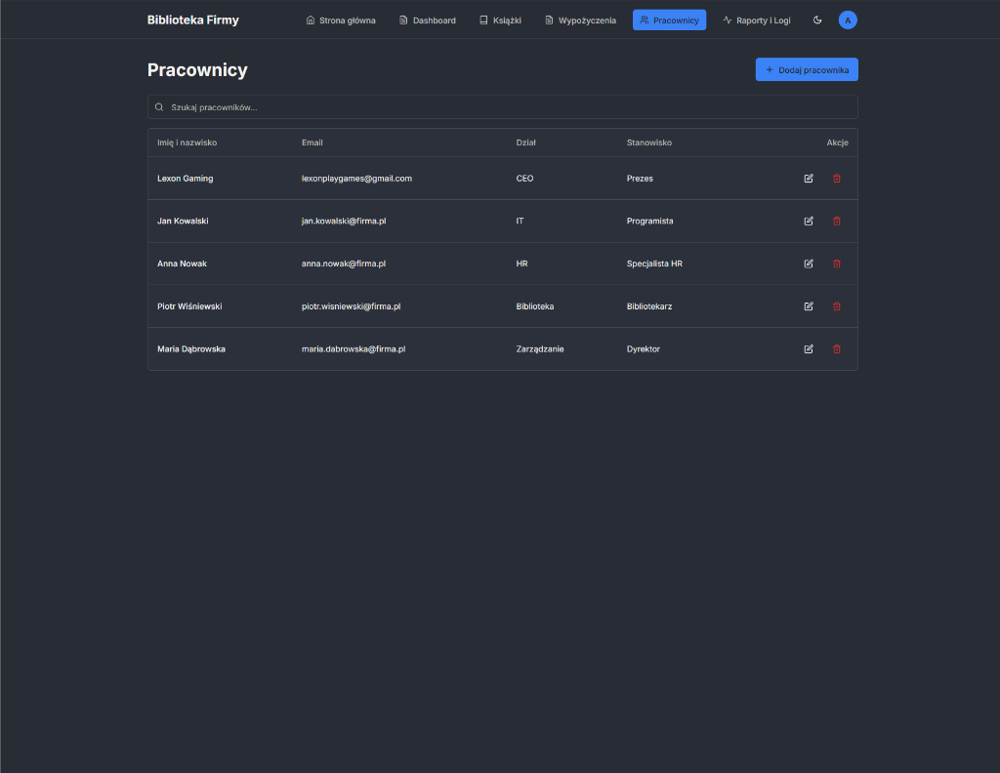
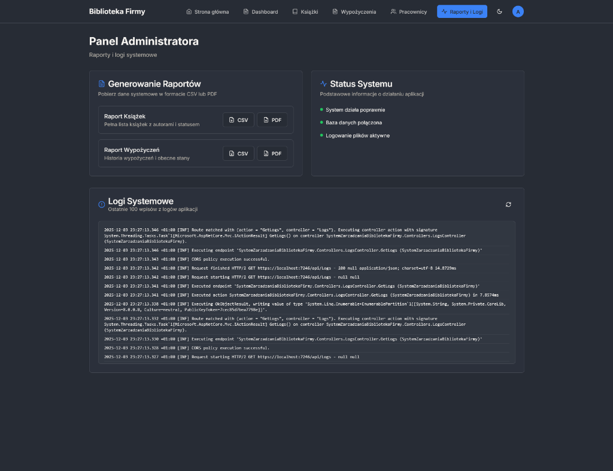
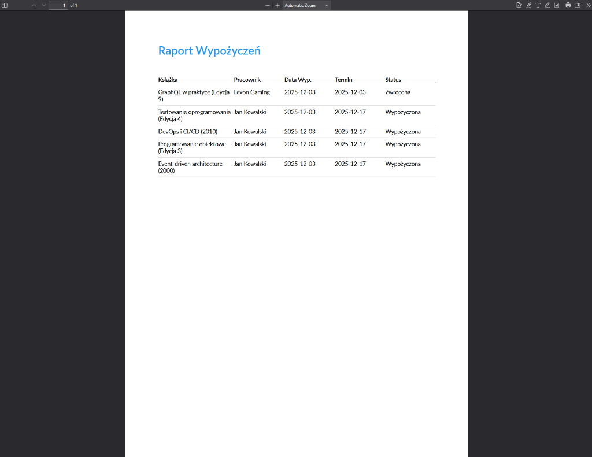

# System Zarządzania Biblioteką Firmową - Dokumentacja Projektu

## 1. Opis Systemu

**System Zarządzania Biblioteką Firmową** to kompleksowa aplikacja webowa stworzona w celu usprawnienia procesu wypożyczania i zarządzania zasobami bibliotecznymi wewnątrz organizacji. Aplikacja rozwiązuje problem ręcznego ewidencjonowania wypożyczeń, braku kontroli nad terminami zwrotów oraz trudności w wyszukiwaniu dostępnych pozycji.

### Główne funkcje systemu:
*   **Katalog Książek**: Przeglądanie, wyszukiwanie i filtrowanie dostępnych książek (po tytule, autorze, kategorii).
*   **Zarządzanie Wypożyczeniami**: Rejestracja wypożyczeń, zwrotów oraz automatyczne śledzenie terminów.
*   **Panel Administratora**: Zarządzanie użytkownikami, pracownikami, księgozbiorem oraz generowanie raportów (PDF/CSV).
*   **Logi Systemowe**: Podgląd aktywności i błędów w systemie dla administratorów.
*   **Powiadomienia**: Informacje o przeterminowanych zwrotach.

### Użytkownicy systemu:
*   **Administrator / Bibliotekarz**: Posiada pełne uprawnienia do zarządzania systemem, dodawania książek, edycji użytkowników i generowania raportów.
*   **Pracownik**: Może przeglądać katalog, sprawdzać swoje aktywne wypożyczenia i historię.

---

## 2. Wymagania Techniczne i Realizacja

### Backend (ASP.NET Core 8.0)
*   **Architektura**: Web API (RESTful).
*   **Baza Danych**: Entity Framework Core (Code First).
*   **Walidacja**: FluentValidation / DataAnnotations dla modeli wejściowych (DTO).
*   **Obsługa Błędów**: Globalny middleware do obsługi wyjątków.
*   **Autoryzacja**: JWT (JSON Web Token) z obsługą ról (Admin, Employee).
*   **Testy**: Projekt przygotowany pod testy jednostkowe (xUnit).

### Baza Danych (SQL Server)
*   **Struktura**: Relacyjna baza danych z tabelami połączonymi relacjami 1:N (np. Category -> Books) oraz N:M (Books <-> Authors).
*   **Integralność**: Klucze obce (FK), klucze główne (PK), unikalne indeksy (ISBN, Email, Username).
*   **Logika w bazie**: Zaimplementowano procedury składowane, funkcje i wyzwalacze (szczegóły w sekcji 4).
*   **Seed Data**: Automatyczne inicjowanie bazy danymi przykładowymi przy starcie.

### Frontend (Next.js / React)
*   **Technologia**: Next.js 14 (App Router), React, TypeScript.
*   **UI**: Tailwind CSS, Shadcn UI.
*   **Komunikacja**: Axios z interceptorami do automatycznego dołączania tokenu JWT.
*   **Funkcjonalności**: Logowanie, CRUD książek, CRUD wypożyczeń, widoki raportów.

---

## 3. Diagram ERD (Struktura Bazy Danych)



---

## 4. Obiekty Bazodanowe (Procedury, Funkcje, Wyzwalacze)

W projekcie zaimplementowano następujące obiekty bazodanowe (wdrożone poprzez migracje EF Core):

### Procedury Składowane
1.  **`GetOverdueLoans`**:
    *   **Opis**: Pobiera listę wszystkich przeterminowanych i niezwróconych wypożyczeń. Łączy tabele `Loans`, `Books` i `Employees` w celu zwrócenia pełnych danych.
    *   **Zastosowanie**: Raportowanie dla administratora.
2.  **`GetEmployeeLoanStatistics`** (`@EmployeeId`):
    *   **Opis**: Zwraca statystyki dla danego pracownika: całkowita liczba wypożyczeń, aktywne wypożyczenia, przeterminowane wypożyczenia.
    *   **Zastosowanie**: Panel użytkownika / Dashboard.

### Funkcje Użytkownika
1.  **`CalculateLoanDays`** (`@LoanDate`, `@ReturnDate`):
    *   **Opis**: Oblicza liczbę dni trwania wypożyczenia. Jeśli książka nie została zwrócona, liczy dni do chwili obecnej (`GETUTCDATE()`).
    *   **Zastosowanie**: Wyliczanie statystyk i kar.

### Wyzwalacze (Triggers)
1.  **`UpdateBookAvailabilityOnLoanReturn`**:
    *   **Opis**: Automatycznie aktualizuje status dostępności książki (`IsAvailable = 1`) w tabeli `Books` w momencie, gdy wypożyczenie zostanie oznaczone jako zwrócone (`IsReturned = 1`) w tabeli `Loans`.
    *   **Typ**: `AFTER UPDATE` na tabeli `Loans`.

---

## 5. Instrukcja Uruchomienia

### Krok 1: Backend (API)
1.  Wymagane: .NET 8.0 SDK, SQL Server (LocalDB).
2.  Otwórz terminal w folderze `SystemZarzadzaniaBibliotekaFirmy`.
3.  Zaufaj certyfikatowi HTTPS (jednorazowo):
    ```powershell
    dotnet dev-certs https --trust
    ```
4.  Uruchom aplikację:
    ```powershell
    dotnet run --launch-profile https
    ```
    *API dostępne pod: `https://localhost:7246`*

### Krok 2: Frontend (Aplikacja Webowa)
1.  Wymagane: Node.js (LTS).
2.  Otwórz terminal w folderze `SystemZarzadzaniaBibliotekaFirmyFrontEnd`.
3.  Zainstaluj zależności:
    ```powershell
    npm install
    ```
4.  Uruchom serwer deweloperski:
    ```powershell
    npm run dev
    ```
    *Aplikacja dostępna pod: `http://localhost:3000`*

### Krok 3: Dane Logowania (Seed Data)
*   **Admin**: `admin` / `Admin123!`
*   **Bibliotekarz**: `bibliotekarz` / `Librarian123!`
*   **Pracownik**: `jan.kowalski` / `Employee123!`

---

## 6. Uruchomienie przez Docker

Aby uruchomić cały system (Baza + Backend + Frontend) jedną komendą:

1.  Upewnij się, że masz zainstalowany **Docker Desktop**.
2.  Otwórz terminal w folderze projektu.
3.  Uruchom komendę:
    ```powershell
    docker-compose up --build
    ```
4.  Aplikacja będzie dostępna pod adresem: **[http://localhost:3001](http://localhost:3001)**
    *(Backend API: http://localhost:8080, Baza danych: localhost, port 1434)*

---

## 6. Zrzuty Ekranu

### 1. Dashboard (Widok Główny)

*Widok główny systemu prezentujący kluczowe statystyki oraz ostatnio dodane książki.*

### 2. Katalog Książek

*Pełna lista książek z możliwością wyszukiwania i filtrowania.*

### 3. Ekran Logowania

*Formularz logowania do systemu.*

### 4. Panel Wypożyczeń

*Widok zarządzania wypożyczeniami (tylko dla administratora).*

### 5. Zarządzanie Pracownikami

*Lista pracowników z możliwością edycji i usuwania kont.*

### 6. Panel Raportów i Logów

*Panel administratora umożliwiający generowanie raportów oraz podgląd logów systemowych na żywo.*

### 7. Przykładowy Raport PDF

*Wygenerowany raport wypożyczeń w formacie PDF gotowy do druku.*
